class: middle, black

---

class: middle, green

# How we work in Tech

---

class: middle

## Our goal:

## Deliver value

---

class: middle

# Standard waterfall

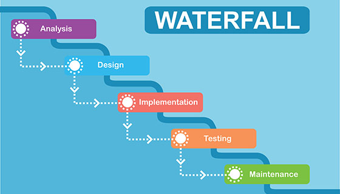

---

class: middle

## But we want to be able react

## to changes and user feedback

---

class: middle

## But without confusing ourselves

### and dying of stress

---

# SCRUM

## Methodology

## 2 weeks

---

## - Backlog

## - Refinement

## - Sprint Planning

## - Sprint Mid-week

## - Retrospective

---

## Backlog

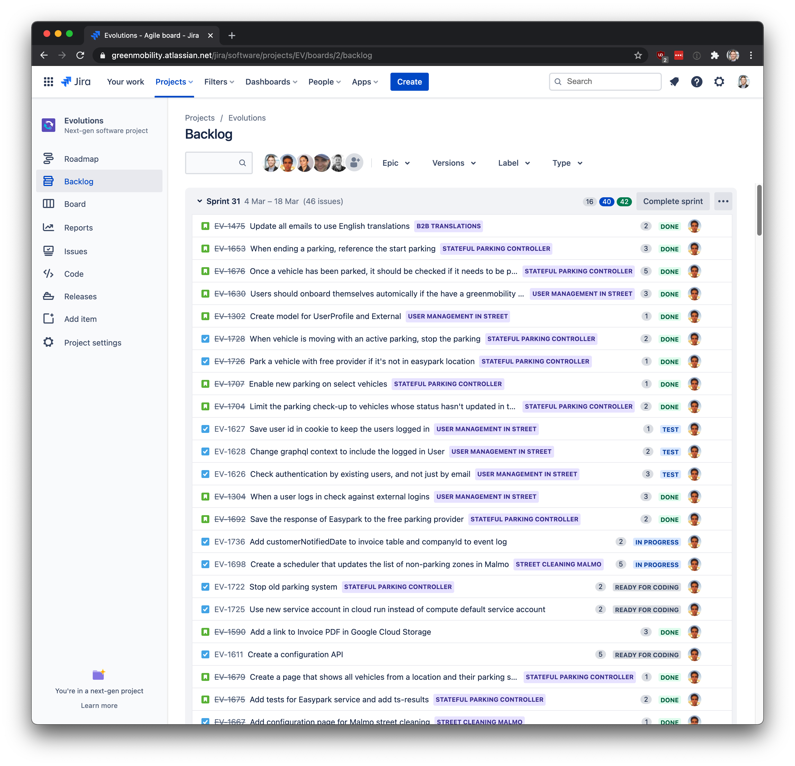

---

### Refinement - Breaking down into tasks

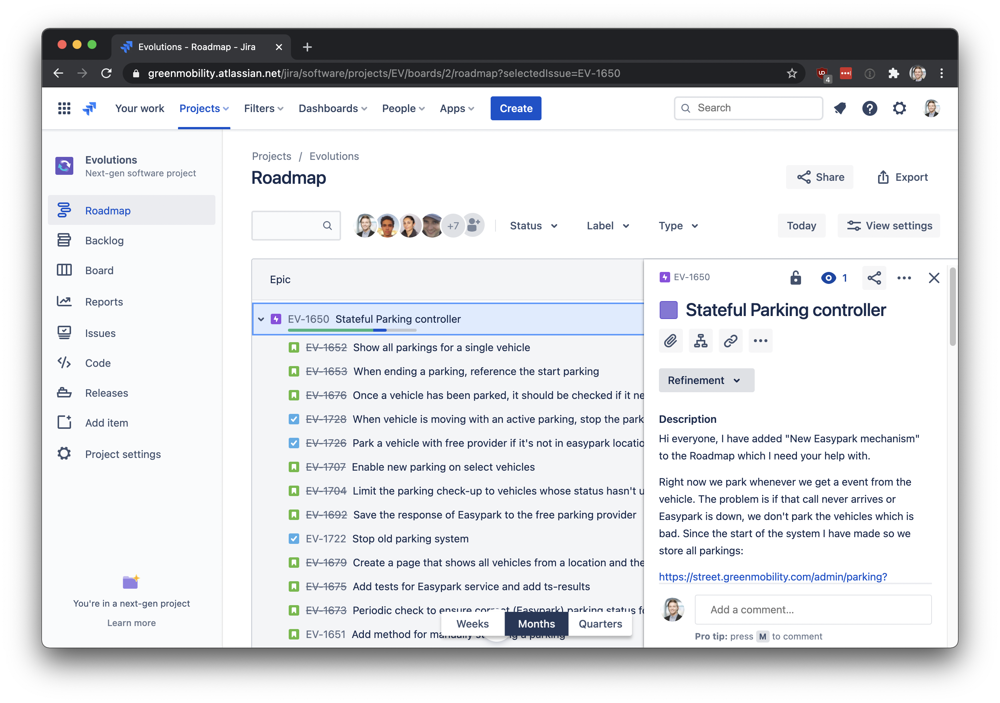

---

# Sprint Planning

## - Taking tasks from the Backlog

## - Committing to a Sprint Goal

---

# Retrospective

## Looking at what went well

## not so well, and what to improve

---

class: middle, black

## Scrum help us deliver substantial work

## While being reactive, but not stressed

---

class: middle, green

# Our workflow to release new code

---

class: middle, center

# Starts with a ticket

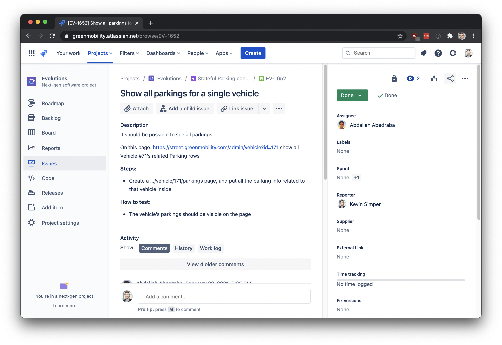

---

class: middle, center

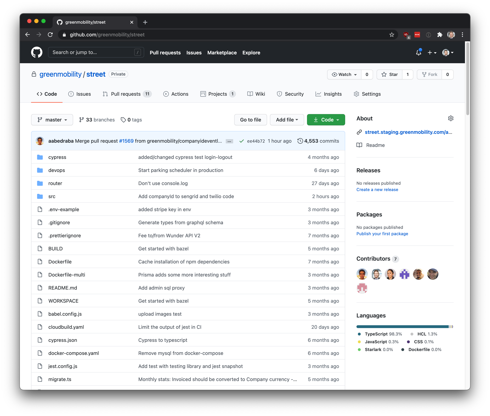

---

class: middle, center

## Checks out or main code and branches out

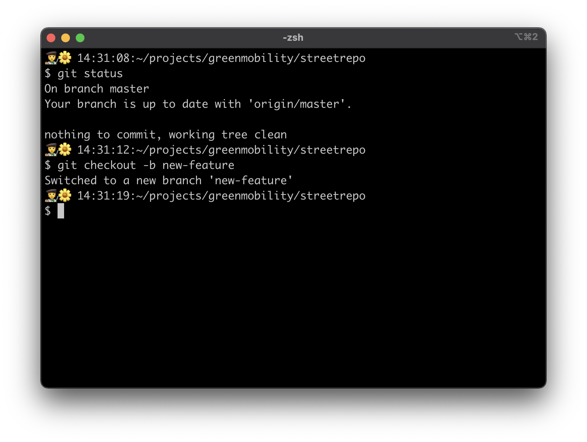

---

### Creates a Pull Request after 15 min - 30 min

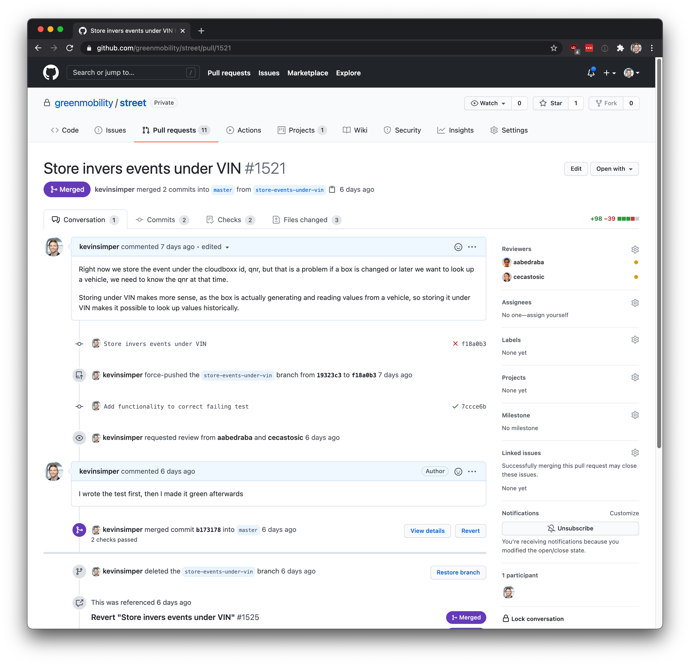

???

https://github.com/greenmobility/street/pull/1521

---

class: middle, center

### Works 2-3 hours

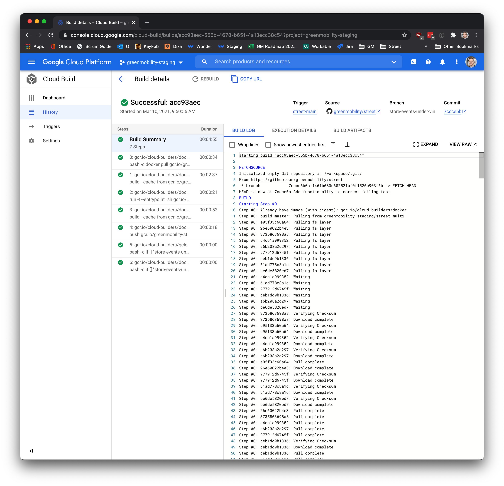

???

https://console.cloud.google.com/cloud-build/builds/acc93aec-555b-4678-b651-4a13ecc38c54?project=greenmobility-staging

---

class: middle, black

# Time for deploying

---

class: middle

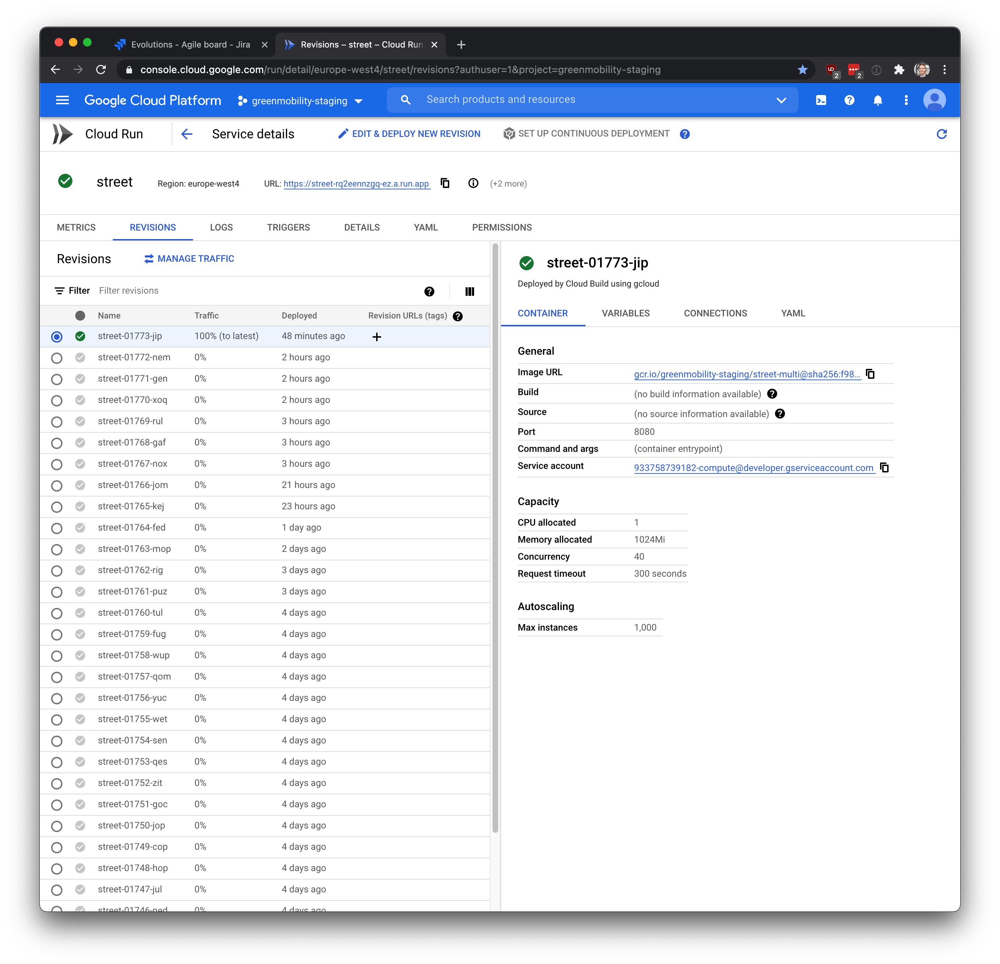

---

# Once verified, promoted staging to production

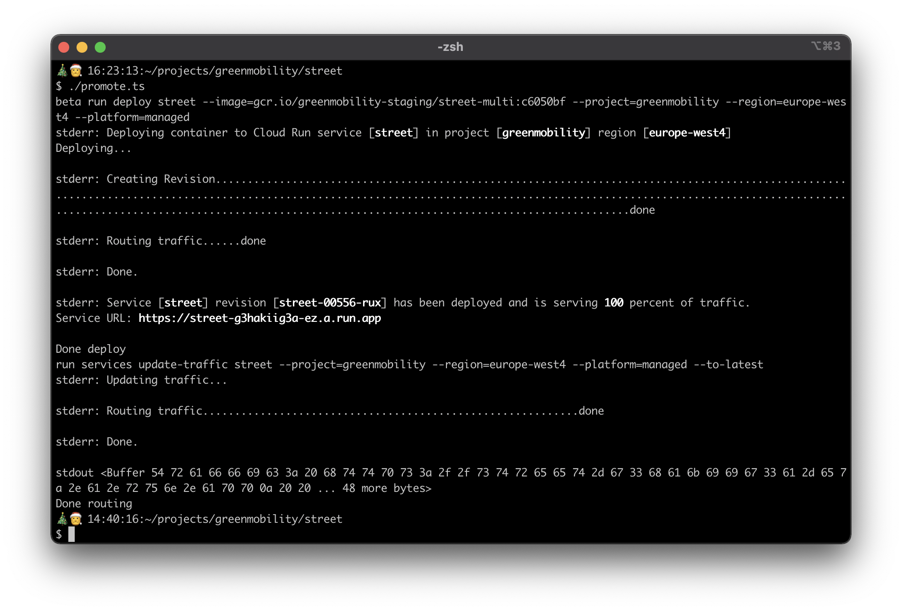

---

class: middle, green

# Our Tools

## As important for our work

---

class: middle, green, center

## Critical

# Maximum 20 minutes to production

---

# Using many technologies

# Some of them:

---

## Programming: Node.js / TypeScript

## Database: Postgresql

## UI: React.js

---

### Google Cloud Platform

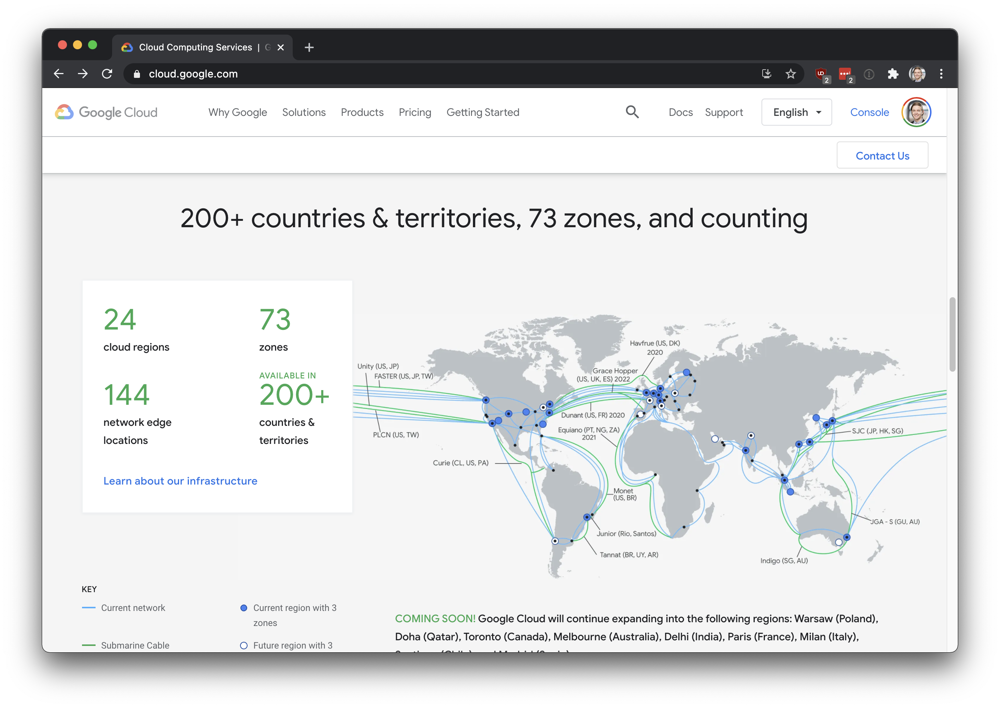

---

class: middle, green

## Major ability to move quickly

## Scaling up and down based on demand

---

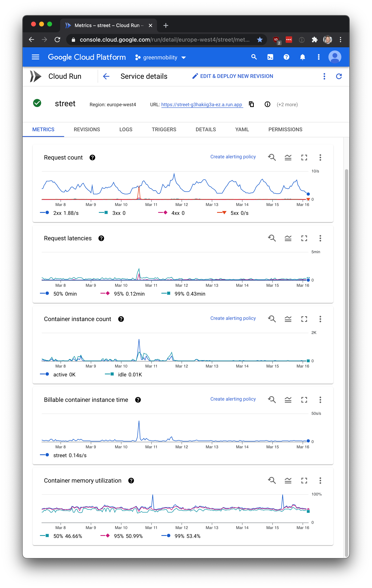

---

class: middle, center

# Our stack and

# way of working

---

class: middle, black

# Constant evolving

# Constant evalutation

# Handle scale

---

## Thank you

## &nbsp;

#### P.S. Follow me on Tik Tok

---

---

## Questions

# Current issues

# Future tech

---

# Topics to discuss

## - New hardware

## - Visualizations of data

## - What to become better at

---
