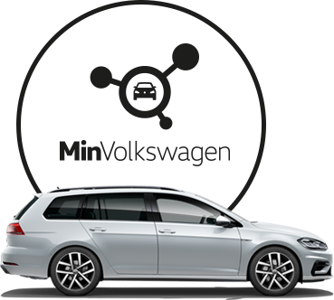
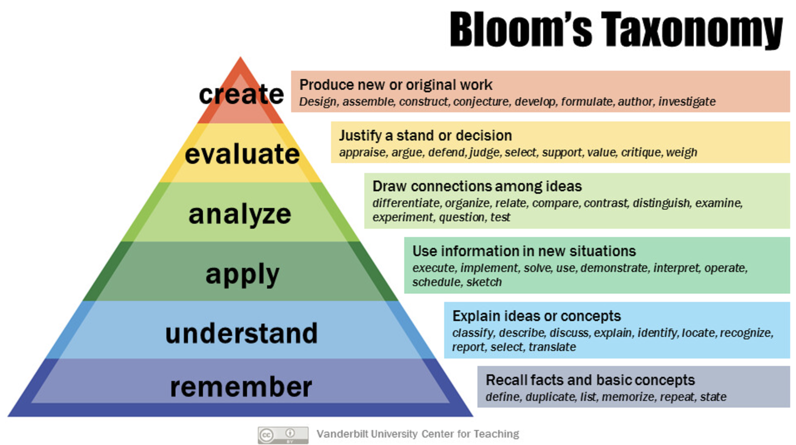
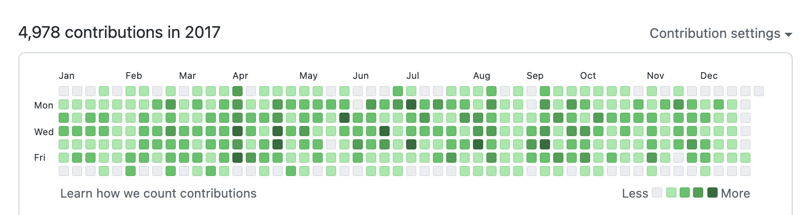
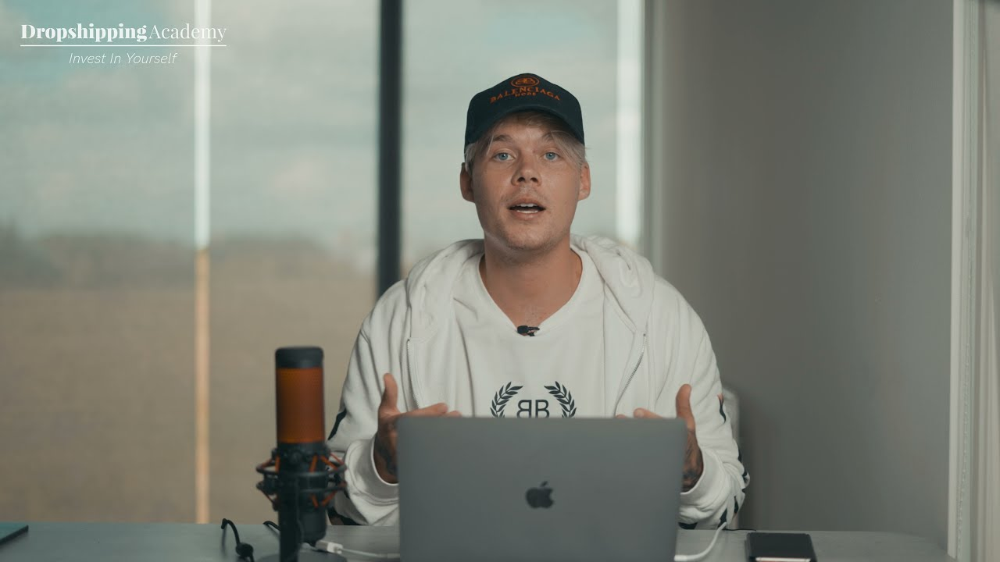

class: black, middle

# Advice for your

# best career 💼

---

class: middle

# What do I want to change today?

---

class: middle

# If I can just change one person mind to take more initiative

---

class: middle

# A good career is taking your own initiative

## You can be your own boss

---

class: middle

# I want to talk about

## 0. My journey

## 1. How to start a career

## 2. What I do at GreenMobility

## 3. What is a good application

---

class: middle

# Survivor Bias

# Why should you listen to me?

## I can give you advice on how to earn a lot of money 🤑

---

class: middle

# 0. My journey/career

---

class: middle

# Got a job at Ravn IT

## Got it because I knew them

## Got fired

---

class: middle

# Got a job at Gorm Larsen &amp; Zornig

## Marketing company

## Consultant

---

class: middle

# Got a job at Blackwood Seven

## Lasted 3 months

---

class: middle

# Got a job at Graduateland

## Startup

## Got inspired by young people

## Young people does not have structure

---

class: middle

# Started my own startup

## YCombinator

## Did not work out

## Different expectations

---

class: middle

# Went traveling

# Started consulting

# Went to conferences

---

class: middle

# Got a job at Semler

## Grew faster than expected

---

class: middle

class: white-picture

background-image: url('india.jpeg')
background-size: cover

#

#

#

#

#

#

#

#

# Went travelling

## India, Prag, SF twice, Madrid

---

class: middle

# Started consulting

---

class: middle

class: white-picture

background-image: url('valthorens.jpeg')
background-size: cover

# Went skiing for 3 months

---

class: middle

# Got a job at GreenMobility

---

class: middle

# What is the common among this?

## I created stuff

## I created events

## I was in charge

---

class: middle

# 1. How to start a career

---

class: middle

# Work on interesting problems

---

class: middle

# Share your work

---

class: middle

# Talk to people and build up connections

---

class: middle

# Start simple

## You can always build something

---

class: middle

# Be good at GitHub

## Collaboration is essential

---

class: middle

# Be generous

## Help others

## Help at meetups

## You will get infinite help

---

class: middle

# Be around people that want to improve

## To improve requires a lot of work

## It took me long time to become good

---

class: middle

# Teach programming

## Blooms taxonomy

## Escape tutorial hell

---

---

class: middle

# Always be coding

## Do not stop coding each day

## Consistency is key

---

class: middle

# Create good readmes

## They are your portfolio

---

class: middle

# Contribute to Open Source

## Help reproduce errors

## Create examples

---

class: middle

# Learn the fundamentals

## Highlevel - React.js

## Lowlevel

##- Browser, HTML, CSS, Data Structures

---

class: middle

# Be an early adopter

---

class: middle

## Focus on what you are good at

## Do 50% what you are good at

## Do 30% what you are not so good at

## Do 20% what you don&#39;t know

---

class: middle

# Improve your tools

## Put time into learning the shortcuts

## Learn the commandline

---

class: middle

# Don&#39;t copy and paste

---

class: middle

# When you have a job

## Overcommunicate

---

class: middle

# Do not only do tech challenges for jobs

---

---

class: middle

# Don&#39;t take money shortcuts

## Do not do drop shipping, affiliate, link building

---

class: middle, black

# What is the common thread?

# You are in charge

---

class: middle, green

# 2. What type of tasks I do at GreenMobility

---

class: middle

# I work as a tech lead

# Car Sharing Platform

---

class: middle

# We have 1000 vehicles you can rent per minute

# We are in 8 cities and are expanding

---

class: middle

# Tech we use

## Node.js, React

## Google Cloud

## Docker, Postgres

---

class: middle

# The technology is important, but everything can be learnt

---

class: middle

# Scaling out solutions we have

---

class: middle

# Collaborating with partners

## Being as efficient as possible

---

class: middle

# Working with IoT data

---

class: middle

# Tech supports other departments:

## Customer Support, Operation, Marketing, Finance, International

---

class: middle

# Goal:

# 10k vehicles in 35 cities by 2025

---

class: middle, orange

# 3. What a good application looks like

---

class: middle

# Can you fit in

---

class: middle

# Quick to read

## Single column

---

class: middle

# Provide context to each thing

## Make it relevant

---

class: middle

# Show rather than tell

---

class: middle

# Be honest

## Think about what you want

## Do not try to oversell

---

class: middle

# Can this person solve any problem?

## Wordpress is not good patterns

# Can this person continue to learn?

---

class: middle, blue

# Sum up

## Start your career by focus on yourself

## Be consistent

## Make your CV, but make it irrelevant

## Email me at kevin.simper@gmail.com
